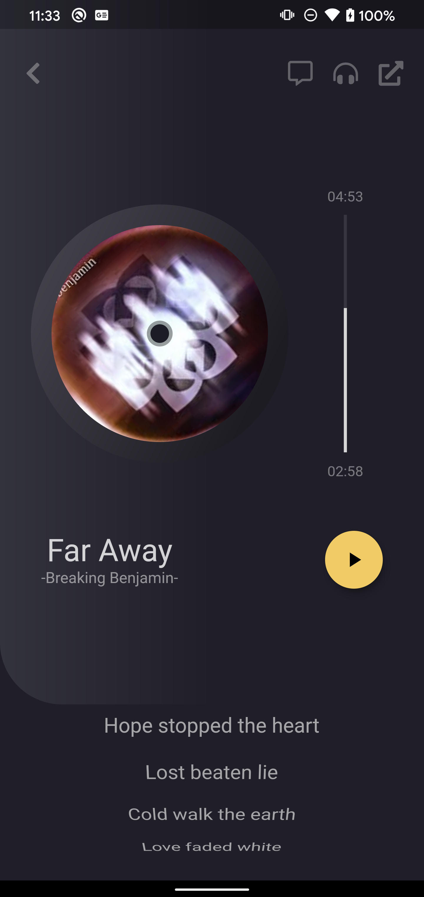

# Flutter Intermedio: Diseños profesionales y animaciones

Del curso de Fernando Herrera: https://cursos.devtalles.com/courses/flutter-Intermedio

## Music Player

Principalmente veremos:

- Crear imágenes que giren
- Usar controladores de la animación
- AnimatedIcons
- Controladores de los iconos animados
- Reproducción de audio
- Barras de progreso
- Manejo de tiempo
- Y más

### Inicio de proyecto

Creamos el proyecto, vamos a `main.dart` y lo vamos modificando.

En la raiz del proyecto creamos la carpeta `assets` y colocamos las imágenes que vienen con el proyecto.

En el archivo `pubscpec.yaml` añadimos la carpeta `assets` para que se puedan ver nuestras imágenes.

En la carpeta `lib` creamos la carpeta `src` y dentro las carpetas `widgets`, `helpers`, `models`, `pages` y `theme`.

Para este proyecto, para no repetir cosas ya vistas en el curso, se da hecho `helpers.dat` y `theme.dart`.

En la carpeta `pages` creamos el archivo `music_player_page.dart`.

En `main.dart` llamamos a nuestra nueva page.
